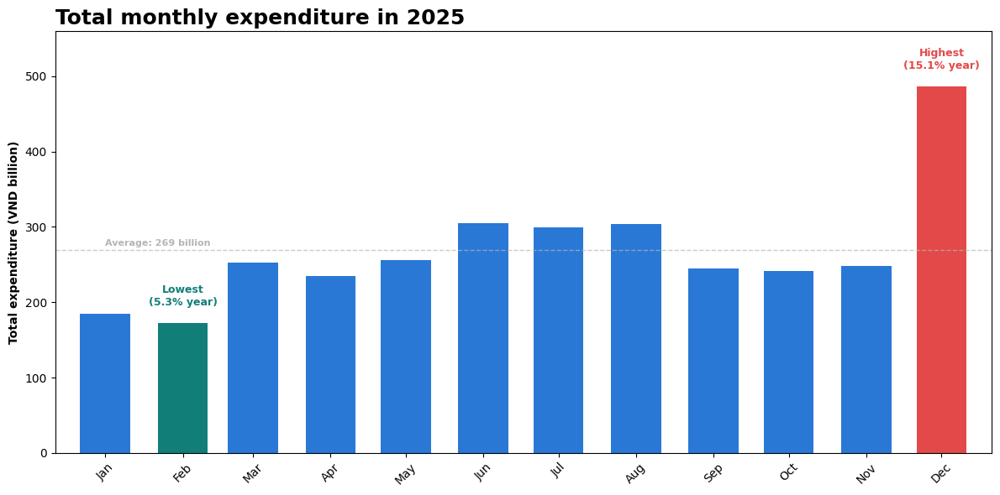
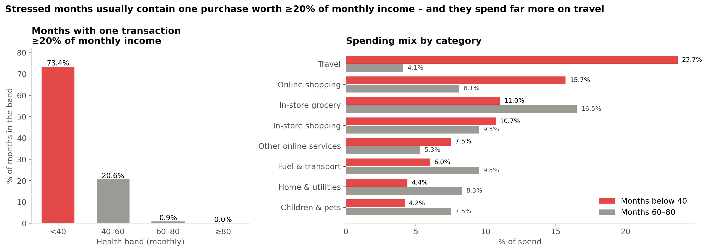
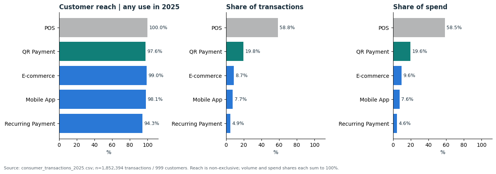
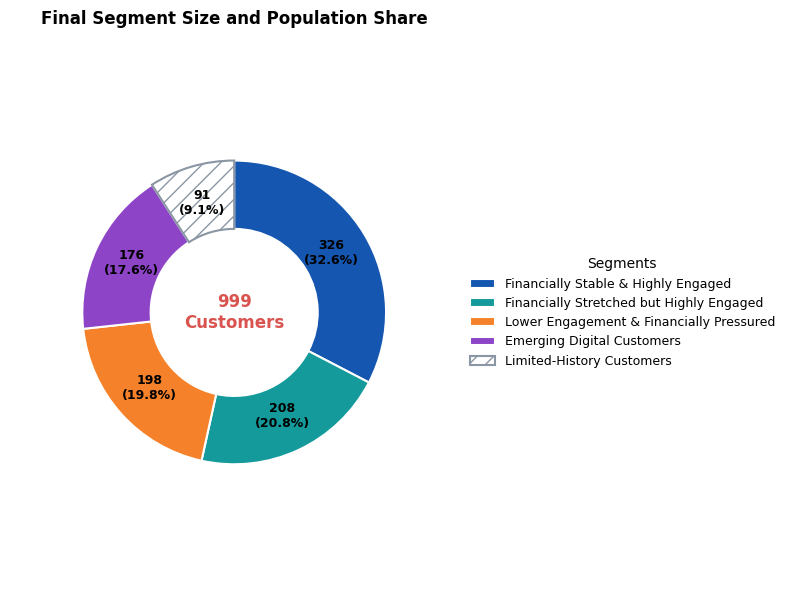
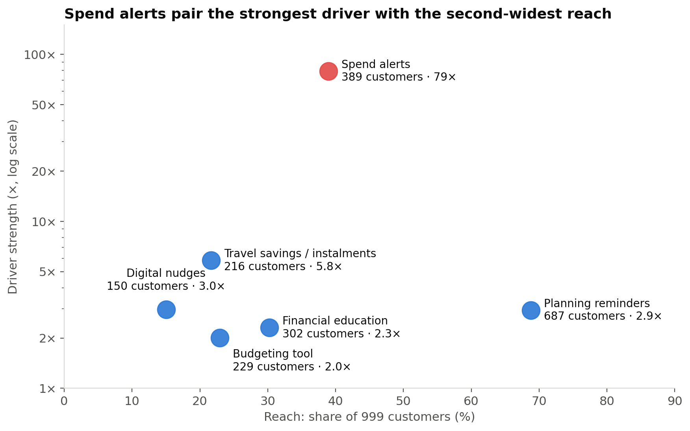

# Consumer Financial Health & Channel Engagement – BI Season 10 (ITB Club)

Team entry for Round 1 of **Business Intelligence Season 10**, organised by ITB Club. The case: ITB, a consumer-finance company in Vietnam, wants to understand its customers' financial wellbeing, spending and channel engagement, find customer segments, and propose supportive actions.

**Main result:** financial stress is rare and short, and most stressed months contain one large purchase. Six non-punitive tools, starting with spend alerts, can reach 89.4% of customers. The health score is never used to deny credit, cut a credit limit or block an account.

This was a five-person team project. My own parts are Task 2, Task 5 and the shared definitions. Tasks 1, 3 and 4 were done by the teammates listed in section 5, so I know their methods in less detail than my own.

> Notebook commentary is written in Vietnamese. Charts and the final slide deck ([slides/BI10_R01_proposal.pdf](slides/BI10_R01_proposal.pdf), 21 slides) are in English. A Vietnamese version of this README is in [README_vi.md](README_vi.md).

---

## 1. Business questions

| Task | Question |
|---|---|
| 1. Exploratory analysis | When, where and on what do customers spend? |
| 2. Financial health | What goes with low financial health, and which customers are affected? |
| 3. Engagement | How engaged are customers, and through which channels? |
| 4. Segmentation | Which distinct customer groups exist? |
| 5. Recommendations | Which supportive actions should ITB offer, to whom, and in what order? |

## 2. Data

| Table | Rows | Grain |
|---|---|---|
| Transactions 2025 | 1,852,394 | one row per transaction |
| Consumer-month 2025 | 10,992 | one row per customer per month |

999 customers in 34 provinces with 396 job titles: 908 have all 12 months, 91 have only 1–2 months. All amounts are synthetic, so customers are compared with ratios and percentiles, not VND amounts. Customer-level findings use the 908 full-year customers; target sizes for actions count all 999.

The raw data is not included in this repository; [data/README.md](data/README.md) lists the files needed.

## 3. Key findings

**Spending (Task 1).** December holds 15.1% of annual spending against 5.3% in February (908 full-year customers). The peak comes from more transactions (+187.6%), not larger tickets (−2.1%). In months scoring below 40, 71.0% of spending is discretionary, against 39.0% in months scoring 80 or more. Fuel & Transport has the most transactions, while Supermarket & Grocery has the highest total spend. Customers under 25 transact often but have the lowest health score among active age groups; even so, age explains only 0.25% of the variation in the score, so it is too weak to segment on.



**Financial health (Task 2).**
- Four monthly ratios (spending ÷ income, credit utilisation, spending volatility, essential share) explain 87.8% of the variation in the health score (R²). The score is mostly a summary of these ratios, so the analysis focuses on when and why they rise.
- Stress is rare and short: 0.9% of customer-months score below 40, and 95.7% of them recover the next month.
- 73.4% of months below 40 contain one purchase worth 20% or more of the customer's own monthly income, against 0.9% of months scoring 60–80. Travel is 23.7% of spending in those months, against 4.1%. December and January hold 48.9% of months below 40.
- Media & arts, public sector and education hold 29.6% of customers but 49.3% of those who ever had a month below 40. Their income sits at the 44th percentile against 52nd elsewhere, while spending is the same (50th).
- A reproducible rule (bottom 25% on health and top 25% on engagement) finds 64 "stressed but highly engaged" customers. Their pressure comes from higher spending (79th percentile), not lower income (62nd).



**Engagement (Task 3).** 99.0% of customer-months are already "high" or "very high" engagement, so the label barely separates customers. Every channel is used by at least 94.3% of customers during the year, yet POS still carries 58.82% of transactions. 59 full-year customers (6.5%) are among the healthiest but least engaged.



**Segmentation (Task 4).** K-Means (K = 4) on the 908 full-year customers, plus a rule-based group for the 91 with limited history, gives five segments: Stable & Engaged 32.6%, Stretched & Engaged 20.8%, Lower Engagement & Pressured 19.8%, Emerging Digital 17.6%, Limited History 9.1% (silhouette 0.19). The two pressured segments hold 65 of the 70 customers who ever scored below 40.



## 4. Recommendations (Task 5)

| Tool | Finding behind it | Target (of 999) | Driver |
|---|---|---|---|
| Spend alerts | 73.4% vs 0.9% of months with a purchase ≥ 20% of income | 389 (38.9%) | 79× |
| Planning reminders | December and January hold 48.9% of months below 40 | 687 (68.8%) | 2.9× |
| Budgeting tools | Stretched customers overspend 2.59 months a year vs 1.29 | 229 (22.9%) | 2.0× |
| Financial education | 12.6% vs 5.5% ever below 40 in three job fields | 302 (30.2%) | 2.3× |
| Digital-channel nudges | 61.6 vs 182.7 transactions a month | 150 (15.0%) | 3.0× |
| Product suggestions | Travel 23.7% vs 4.1% of spending in stressed months | 216 (21.6%) | 5.8× |

Driver = how many times more often the problem shows up in the target group than in other customers. Together the six tools reach 893 customers (89.4%). Suggested rollout starts with spend alerts (strongest driver, second-widest reach), then planning reminders before December.



## 5. Team and contributions

| Member | Role |
|---|---|
| Nguyễn Hoàng Anh Duy | Team leader. Shared definitions and final integration; Task 2 (financial health) and Task 5 (recommendations); executive summary and case introduction |
| Nhi | Task 1 – exploratory analysis |
| Giang | Task 1 – exploratory analysis |
| Nguyên | Task 3 – engagement |
| Dương | Task 4 – segmentation |

## 6. Repository structure

```
├── slides/BI10_R01_proposal.pdf        final 21-slide deck
├── data/                               list of the raw data files
├── task1_eda/                          3 notebooks, charts/:
│     part1  Q1, Q2, Q5 on the 908 full-year customers (slides 1, 5, 8)
│     part2  data checks and answers to Q1–Q5 on all 999 customers
│     part3  seasonality, categories, provinces and digital channels on all 999 (slides 4, 6, 7)
├── task2_financial_health/             notebook, charts/, outputs/
├── task3_engagement/                   notebook, charts/
├── task4_segmentation/                 notebook, charts/, outputs/
└── task5_recommendations/              notebook, inputs/, charts/, outputs/
```

## 7. How to reproduce

1. Put the four files listed in [data/README.md](data/README.md) into `data/`.
2. Install Python 3.10+ with `pandas`, `numpy`, `scipy`, `scikit-learn`, `matplotlib` and `jupyter`.
3. Run each notebook from its own folder. Task 5 reads outputs of Task 2 and Task 4, so run those first.

## 8. Limitations

- Synthetic data covering one year (2025); seasonal findings need a second year to confirm.
- Findings show what goes together, not cause and effect. Each action should be piloted with a control group first.
- The 20% large-purchase threshold was not tested against other values.
- No data on notification consent, so target sizes count eligible customers, not customers certain to be reached.
- The Task 1 notebooks use two bases: part1 uses the 908 full-year customers, part3 uses all 999. This is why December is 15.1% on slide 1 and 15.04% on slide 4.
